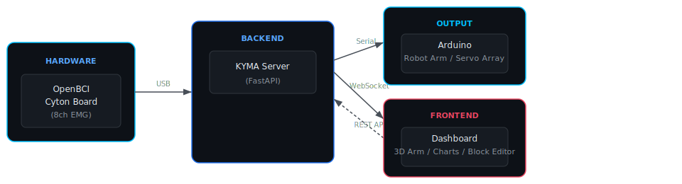
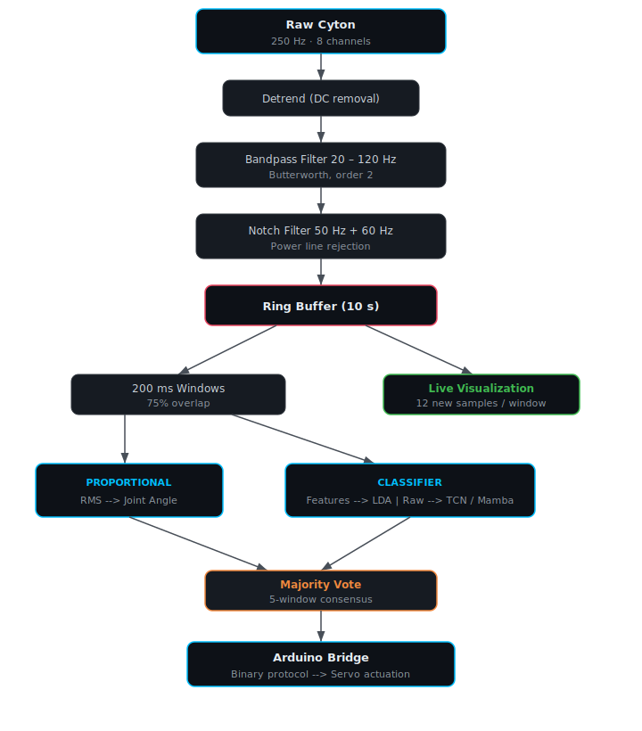

<p align="center">
  
</p>

<h1 align="center">KYMA</h1>

<p align="center">
  <em>Open-source biosignal control platform — from wave to action.</em>
</p>

<p align="center">
  
  
  
  
  
</p>

<p align="center">
  <a href="https://buymeacoffee.com/SageFlugel"></a>
  <a href="https://x.com/pericleshimself"></a>
</p>

---

## Overview

**KYMA** is a real-time biosignal acquisition, processing, and control platform built on top of [OpenBCI](https://openbci.com/) hardware. It captures EMG/EEG/ECG signals, runs them through configurable pipelines, and maps the output to physical actuators or software actions — all from a single browser dashboard.

<p align="center">
  <picture>
    <source media="(prefers-color-scheme: dark)" srcset="docs/architecture.svg"/>
    
  </picture>
</p>

### Key Features

| Feature | Description |
|---------|-------------|
| **Real-time EMG visualization** | 8-channel live waveform display with per-channel RMS, signal quality indicators, and fatigue monitoring |
| **Three classifier backends** | LDA (fast, feature-based), TCN (temporal convolutional network), Mamba (state space model) — all train in-browser |
| **Proportional control** | Direct channel-to-joint mapping with configurable gain, dead zone, and adaptive baseline — no training required |
| **3D arm simulation** | Interactive Three.js arm with multiple models (humanoid hand, industrial 6-axis) and 12-DOF joint control |
| **Visual block programming** | Drag-and-drop node editor for building custom control pipelines — map any signal to any action |
| **Session recording** | Raw EMG + event logging to CSV/JSON for offline analysis and reproducibility |
| **Arduino serial bridge** | Binary protocol for real-time servo control with ESTOP safety |
| **Fully configurable** | Environment variables, runtime config, and persistent UI settings |

---

## Architecture

```
KYMA/
├── server/                     # Python backend (FastAPI + WebSocket)
│   ├── main.py                 # HTTP/WS server, lifespan management, API routes
│   ├── brainflow_stream.py     # BrainFlow Cyton streaming + ring buffer + filters
│   ├── emg_pipeline.py         # Feature extraction, classifier orchestration, voting
│   ├── classifiers.py          # LDA, TCN, Mamba implementations
│   ├── calibration.py          # Multi-stage hardware calibration wizard
│   ├── arduino_bridge.py       # Binary serial protocol to MCU servo controller
│   ├── session_recorder.py     # Raw data + event persistence
│   ├── config.py               # Central configuration (env vars + defaults)
│   └── models.py               # Pydantic request/response schemas
│
├── dashboard/                  # Browser frontend (vanilla JS, no build step)
│   ├── index.html              # Single-page app layout + styles
│   └── app.js                  # EMG visualization, 3D arm, block editor, WS client
│
├── firmware/                   # Microcontroller code
│   └── arm_controller/
│       └── arm_controller.ino  # Arduino servo driver (binary protocol)
│
├── run.py                      # CLI launcher
├── requirements.txt            # Python dependencies
└── LICENSE                     # AGPL-3.0
```

---

## Quick Start

### Prerequisites

- **Python 3.10+**
- **OpenBCI Cyton** board + USB dongle (or use mock mode)
- **Arduino** (optional — only for physical servo control)

### Quick Launch (Windows)

```bash
git clone https://github.com/YOUR_USERNAME/kyma.git
cd kyma
```

Double-click **`KYMA.bat`** — it handles everything automatically:
- Creates a virtual environment
- Installs all dependencies (first run only)
- Starts the server
- Opens KYMA in a native desktop window

### Manual Setup

```bash
pip install -r requirements.txt
```

### Run (mock mode — no hardware)

```bash
cd server
# Windows PowerShell:
$env:EMG_MOCK="1"; python main.py

# Linux/macOS:
EMG_MOCK=1 python main.py
```

Open **http://localhost:8000** in your browser.

### Run (real Cyton board)

```bash
cd server
# Windows — adjust COM port to match your dongle:
$env:CYTON_PORT="COM8"; python main.py

# Linux:
CYTON_PORT=/dev/ttyUSB0 python main.py
```

### Run (with Arduino servo arm)

```bash
cd server
$env:CYTON_PORT="COM8"; $env:ARDUINO_PORT="COM4"; python main.py
```

---

## Configuration

All settings live in `server/config.py` and can be overridden via environment variables:

| Variable | Default | Description |
|----------|---------|-------------|
| `EMG_MOCK` | `0` | `1` = simulated board + mock Arduino |
| `BOARD_ID` | `0` | BrainFlow board ID (`0` = Cyton, `-1` = synthetic) |
| `CYTON_PORT` | `COM8` | Serial port for OpenBCI dongle |
| `ARDUINO_PORT` | `COM4` | Serial port for Arduino |
| `PORT` | `8000` | HTTP server port |

---

## Usage Guide

### Proportional Control (no training needed)

The fastest way to get started — map EMG channels directly to joint angles:

1. Start the stream
2. In the **Proportional Control** panel, check **Enable**
3. Add mappings: `CH1 → Elbow (+ flex)`, `CH2 → Elbow (− extend)`, etc.
4. Adjust **Gain** (sensitivity) and **Dead zone** (noise threshold)
5. Flex your muscles — the 3D arm responds in real time

### Gesture Classification (requires training)

For discrete gesture recognition with higher accuracy:

1. Start the stream
2. Select a classifier (LDA recommended for getting started)
3. For each gesture: click **Hold**, perform the gesture for 3-5 seconds, release
4. Click **Train Model**
5. The arm now responds to recognized gestures automatically

### Electrode Placement

KYMA gives you full control over channel-to-muscle mapping — place electrodes on whichever muscles you want to control and assign them in the dashboard. Here's a common upper-limb setup as a starting point:

| Channels | Example Muscles | Example Controls |
|----------|----------------|-----------------|
| CH1 + CH2 | Biceps / Triceps | Elbow flex/extend |
| CH3 + CH4 | Wrist flexors / extensors | Wrist pitch |
| CH5 + CH6 | Forearm pronators / supinators | Forearm rotation |
| CH7 + CH8 | Finger flexors / extensors | Grip |

> **Tip:** You can map any channel to any joint or action through the Proportional Control panel or the visual block editor. Experiment with different placements to find what works best for your use case.

*Ground/reference: earlobe clip on BIAS + SRB2*

---

## Signal Processing Pipeline

<p align="center">
  <picture>
    <source media="(prefers-color-scheme: dark)" srcset="docs/pipeline.svg"/>
    
  </picture>
</p>

---

## Classifiers

| Backend | Input | Training Data | Speed | Best For |
|---------|-------|--------------|-------|----------|
| **LDA** | Hand-crafted features (MAV, RMS, WL, ZC, SSC) | 30+ windows/gesture | ~1 s train | Quick prototyping, few gestures |
| **TCN** | Raw EMG windows | 60+ windows/gesture | ~30 s train | Higher accuracy, more gestures |
| **Mamba** | Raw EMG windows | 60+ windows/gesture | ~60 s train | Temporal patterns, CPU-safe SSM |

All classifiers include 3× data augmentation (noise injection, amplitude scaling, channel dropout) for the deep learning backends.

---

## Arduino Firmware

The firmware in `firmware/arm_controller/` implements a minimal binary protocol over serial at 115200 baud:

| Command | Bytes | Response | Description |
|---------|-------|----------|-------------|
| MOVE | `[0x01, joint, angle]` | `[0xAA, joint]` | Set servo angle (0-180) |
| ESTOP | `[0x02]` | `[0xAA, 0x00]` | Emergency stop all servos |
| HOME | `[0x03]` | `[0xAA, 0x00]` | Return to neutral (90) |
| PING | `[0x04]` | `[0xBB, 0x00]` | Heartbeat check |

Flash via Arduino IDE. Servos connect to pins 2-9. Full wiring diagrams, protocol details, and .ino export instructions are available in the **Arduino Guide** tab inside the dashboard.

---

## API Reference

The server exposes a REST API (see `/docs` for interactive Swagger UI when running):

| Endpoint | Method | Description |
|----------|--------|-------------|
| `/api/status` | GET | System state, streaming status, training info |
| `/api/stream/start` | POST | Start BrainFlow acquisition |
| `/api/stream/stop` | POST | Stop acquisition |
| `/api/calibrate` | POST | Run calibration wizard |
| `/api/train/record` | POST | Start/stop recording gesture windows |
| `/api/train/train` | POST | Train classifier |
| `/api/move` | POST | Move single servo joint |
| `/api/gesture` | POST | Execute named gesture |
| `/api/estop` | POST | Emergency stop |
| `/api/sessions` | GET | List recorded sessions |
| `/ws` | WebSocket | Real-time EMG, predictions, calibration events |

---

## Contributing

Contributions are welcome under the terms of the AGPL-3.0 license. All derivative works must remain open source.

1. Fork the repository
2. Create a feature branch (`git checkout -b feature/my-feature`)
3. Commit your changes (`git commit -am 'Add my feature'`)
4. Push to the branch (`git push origin feature/my-feature`)
5. Open a Pull Request

---

## License

**KYMA** is licensed under the [GNU Affero General Public License v3.0](LICENSE).

This means:
- ✅ You can use, study, and share this software freely
- ✅ You can modify and distribute your own versions
- ⚠️ You **must** release your modifications under the same license
- ⚠️ If you run a modified version as a network service, you **must** provide source code to users
- ❌ You **cannot** make closed-source derivatives

---

<p align="center">
  <em>KYMA — from wave to action</em>
</p>
