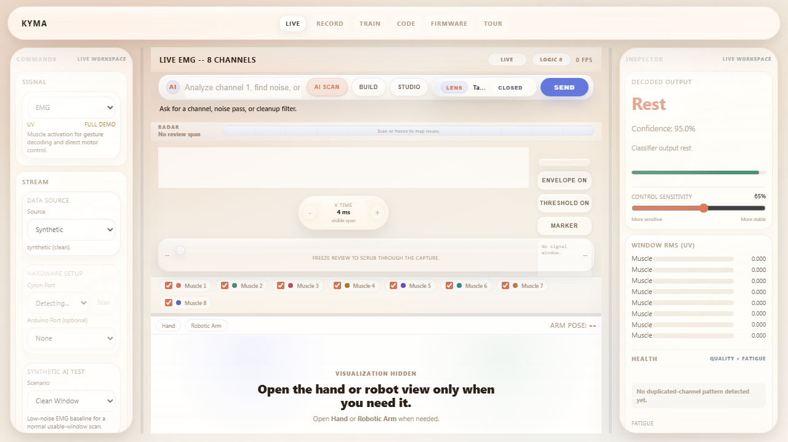
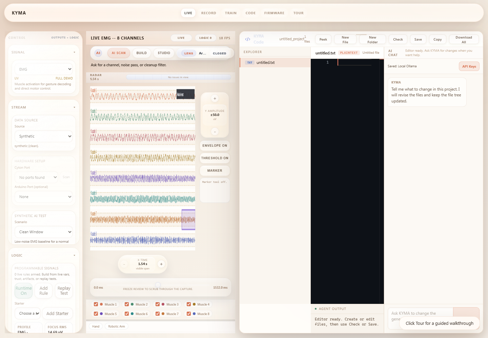
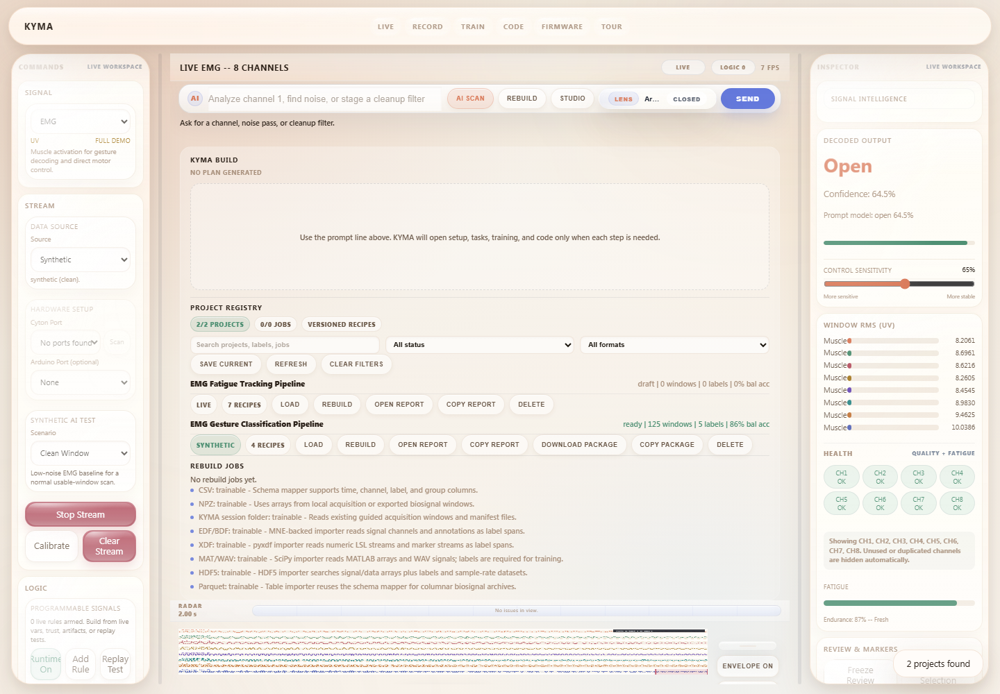
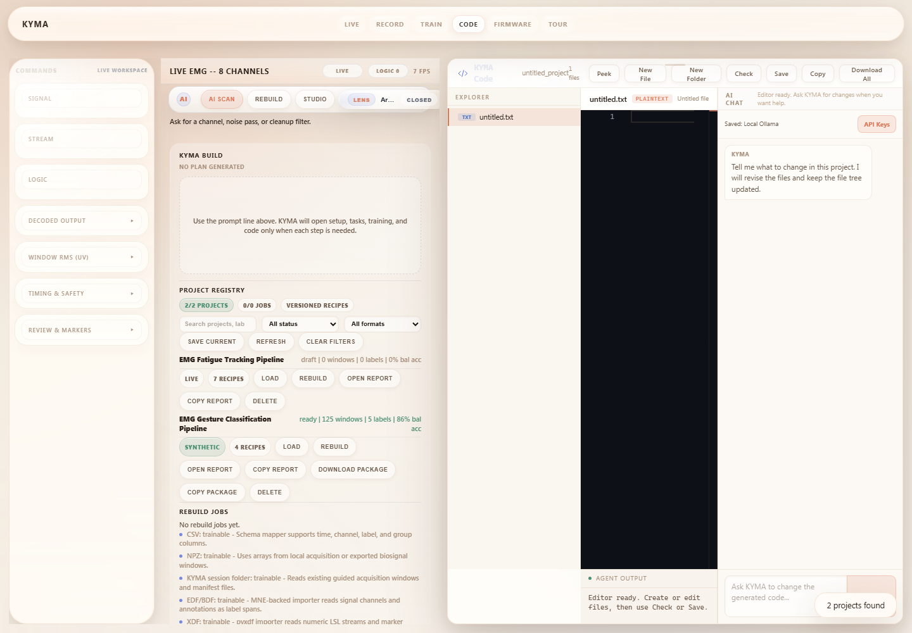

# KYMA

KYMA is a biosignal workflow OS for turning live EMG, EEG, ECG, EOG, PPG, EDA, respiration, and temperature streams into reviewable signals, programmable events, generated code, and hardware output.

It combines a FastAPI backend, a browser-based signal workspace, DSP tools, guided recording, model workflows, generated firmware, and live control routes for Arduino, OSC, LSL, and serial-style integrations.



## What It Does

- Streams biosignals from hardware, synthetic demo data, playback, or LSL input.
- Shows profile-aware live scopes, diagnostics, review windows, markers, and signal quality cues.
- Freezes and inspects chunks with FFT, PSD, spectrogram, autocorrelation, histogram, envelope, correlation, and related DSP tools.
- Builds signal logic rules that map live features and labels into actions.
- Supports guided recording, datasets, baseline training, model checks, and package export.
- Generates and manages firmware/code artifacts for downstream apps and microcontroller workflows.
- Exposes REST and WebSocket APIs for automation and integration.
- Includes an ECG/EDA arousal monitor for stress-style experiments. It reports physiological arousal only, not truth or deception.

## UI Preview

| Live scope | Control workspace |
|---|---|
|  |  |

| Pipeline workspace | Code workspace |
|---|---|
|  |  |

## Architecture

```text
KYMA/
|-- server/                     # FastAPI backend, WebSocket stream, biosignal services
|   |-- main.py                 # API routes and runtime orchestration
|   |-- brainflow_stream.py     # hardware, synthetic, playback, and LSL input streams
|   |-- biosignal_pipeline.py   # modality/profile-aware feature routing
|   |-- *_pipeline.py           # EMG, EEG, ECG, EOG, PPG, EDA, respiration, temperature
|   |-- live_diagnostics.py     # signal health, spectrum, timing, safety checks
|   |-- signal_workshop.py      # frozen-chunk DSP analysis
|   |-- filter_lab.py           # digital filter design and export
|   |-- ai_workflow.py          # workflow assistant and signal review helpers
|   |-- code_generator.py       # generated app/code package support
|   |-- firmware_workspace.py   # generated sketch management
|   `-- models.py               # Pydantic schemas
|
|-- dashboard/                  # browser UI, vanilla JS, no frontend build step
|   |-- index.html              # app shell and styling
|   `-- app.js                  # workspaces, charts, pipeline, logic, firmware UI
|
|-- firmware/                   # Arduino examples and generated firmware seed files
|-- docs/                       # diagrams, screenshots, project notes
|-- tests/                      # Python and Playwright smoke tests
|-- requirements.txt            # runtime Python dependencies
|-- requirements-dev.txt        # test/development dependencies
|-- package.json                # browser automation scripts
`-- LICENSE
```

## Quick Start

### Windows launcher

```powershell
.\KYMA.bat --browser --port 8007
```

### Manual Python run

```powershell
python -m venv .venv
.\.venv\Scripts\pip install -r requirements.txt
.\.venv\Scripts\python launch.py --browser --port 8007
```

Open `http://127.0.0.1:8007`.

### Synthetic demo stream

1. Start KYMA.
2. Open the dashboard.
3. Choose the `Synthetic` source.
4. Start the stream.
5. Use the Live, Record, Train, Control, Pipeline, Code, Firmware, Bench, Guide, and Tour surfaces as needed.

## Hardware Notes

For a real Cyton board:

```powershell
$env:CYTON_PORT = "COM8"
python launch.py --browser --port 8007
```

For Cyton plus Arduino output:

```powershell
$env:CYTON_PORT = "COM8"
$env:ARDUINO_PORT = "COM4"
python launch.py --browser --port 8007
```

Set the COM ports to match your machine.

## Main Workflows

### Review a live signal

Start a stream, inspect the live scope, freeze the review window, mark a region, and send the selected chunk to the analysis tools when deeper DSP review is needed.

### Run arousal experiments

Use ECG for heart-rate/RR timing and EDA/GSR for skin-conductance changes. KYMA shows an Arousal / Stress Monitor in the decoded output panel when those profiles emit enough metrics. Treat the score as a physiological response marker, not as a lie detector.

### Build with signal logic

Use live variables such as RMS, dominant frequency, artifact labels, model labels, prediction confidence, clip percentage, and QA score to trigger markers, focus windows, model actions, serial output, OSC messages, or firmware/hardware routes.

### Create models and generated apps

Use guided recording or datasets to collect examples, train or evaluate a baseline, check runtime quality, and export a generated package or code workspace.

### Work with firmware

Generate sketches, inspect or edit them inside KYMA, and compile/upload when `arduino-cli` is available locally.

## API

The backend exposes REST routes and a WebSocket stream. While KYMA is running, open `/docs` for the live OpenAPI schema.

| Endpoint | Method | Purpose |
|---|---:|---|
| `/api/status` | GET | runtime state, signal profile, diagnostics, AI/pipeline state |
| `/api/config` | GET | runtime configuration and profile capabilities |
| `/api/stream/start` | POST | start hardware, synthetic, playback, or LSL input |
| `/api/stream/stop` | POST | stop streaming |
| `/api/session/start` | POST | start recording |
| `/api/session/stop` | POST | stop recording |
| `/api/review/marker` | POST | save a review marker |
| `/api/filterlab/design` | POST | preview a digital filter |
| `/api/workshop/analyze` | POST | analyze a selected signal chunk |
| `/api/firmware/*` | varies | firmware workspace, compile, and upload routes |
| `/api/ai/*` | varies | workflow assistant and routing helpers |
| `/ws` | WebSocket | live samples, predictions, diagnostics, markers, and state |

## Development

Install optional tooling:

```powershell
.\.venv\Scripts\pip install -r requirements-dev.txt
npm install
```

Run checks:

```powershell
python -m pytest
npm run check:js
npm run test:e2e
```

The Playwright smoke test expects KYMA to be running at `http://127.0.0.1:8007` unless `KYMA_BASE_URL` is set.

## Repository Hygiene

Generated sessions, local models, logs, Playwright traces, browser screenshots, caches, virtual environments, and runtime output are intentionally ignored. Keep source, docs, tests, firmware, configuration, and curated screenshots in git.

## Limits

KYMA is early-stage software. Some model and AI paths are heuristic or partially integrated, support varies by signal profile, and firmware compile/upload depends on local tools. The AI layer is for workflow assistance and signal review, not medical diagnosis.

## License

KYMA is licensed under the [GNU Affero General Public License v3.0](LICENSE).
